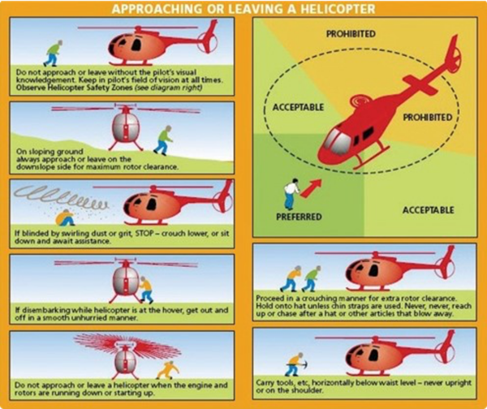
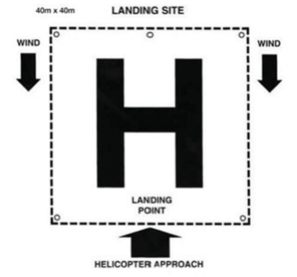
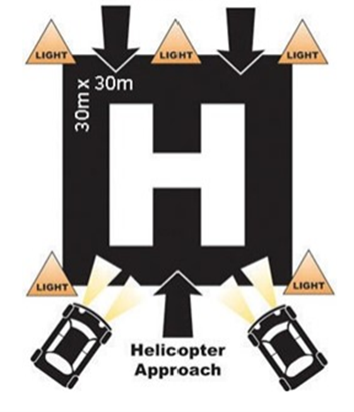

## Purpose
To outline the procedure for lifesaving services to secure a helicopter landing site.

## Overview
All SLS personnel must be aware of helicopter safety. The pilot will have final and ultimate decision on whether and where to land.

## Procedure

### Approaching a Helicopter
Refer to graphic

 
### Establishing a Landing Site
1.	Nominate a suitable lifesaver/lifeguard to manage the Landing Site.
2.	Locate flat area of land 50m by 50m (40m2 minimum).
3.	Clear area of all people / animals.
4.	Remove all loose objects (umbrellas, surfboards, tents etc.).
5.	Ensure all access points to the Landing Site are manned by lifesavers (preventing public access) facing outward to view hazards.
6.	Establish radio contact with helicopter on Channel 3 prior to landing.
7.	Be aware of debris as the helicopter lands or takes off.
8.	The helicopter will land and take off into the wind (in most instances).
9.	When dealing with the helicopter on water, the IRB/RWC should be positioned at the 2 o’clock location of the helicopter.

#### Day Time

 
#### Night Time
	

 
### SWAT Checks

The SWAT acronym outlines the criteria for evaluating a landing zone for a helicopter. Each point addresses a different aspect of the landing area to ensure it is safe and suitable for helicopter operations:

- Size: 30x30m Minimum, unless previously approved. Slope: Is the slope level?
- Surface: Is the surface firm and suitable for landing on?
- Surround: Is the surroundings clear? i.e., no light poles, wires etc. 
- Shape: Is the shape appropriate.
- Sun: Is the sun going to be a glare hazard.
- Wind: What is the wind direction? The helicopter will always approach pointing towards the wind. Wires: are there any wires? They may be hard for the crew to see.
- Approach: The helicopter will approach and depart pointing towards the wind. Is this area clear? i.e. no powerlines, no tall buildings, light poles etc.
- Terrain and Turbulence: Buildings, structures, cliffs etc may cause heavy turbulence downwind.

If in doubt on any of these issues, radio the crew and alert them to this fact. The helicopter will always orbit and inspect a location themselves and it is preferable for them to be aware of dangers.