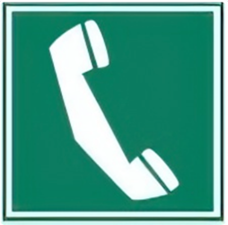

## Purpose

To outline ‘public emergency contact information’ for promotion by SLS services.

## Overview

SLSSA has in place structured emergency communication processes which must be adhered to by all members/clubs/services.

This structure is founded on ‘Triple Zero’ (000) and includes complementary systems such as the Surf Emergency Response System, State Operations Centre (SOC) (call sign SurfCom) procedures and other centralised information (Beachsafe).

## Procedure

### Public Emergency Contact Information

SLS services **must** promote ‘Triple Zero’ as the public avenue for reporting emergencies. The approved public message for signage and websites etc is **In an emergency dial 000**.

Note: For in-water specific incidents/emergencies, SLS services should promote ‘000 – Police’.

SLSC and services **must not** promote any other emergency contact information (other than Triple Zero) to the public. This includes any local/regional emergency contact information for a club/service or individual member.

The Surf Emergency Response System (13 SURF), contactable on 13 7873, **must not** be promoted to the public/media or any parties, other than to the appropriate emergency services, by the appropriate SLS officers at SLSSA. Refer to [SOP 12.2 – Surf Emergency Response System (SERS).](#_12.2_Surf_Emergency)

Triple Zero is Australia’s primary telephone number to call for assistance in life threatening or time critical emergency situations. Dialing 112 directs you to the same Triple Zero call service and does not give your call priority over Triple Zero.

After notifying Police via Triple Zero, an SLS member may pass relevant information on an unfolding incident to the State Operations Centre by dialing 13 SURF – this number is monitored 24/7.

### Surf Club Voicemail Greetings

All dedicated landline and mobile lifesaving service phones must provide a consistent initial answer- phone message (excluding call-divert systems).

“You have called ‘Club/Service Name’, if this is a rescue emergency, please hang up now and dial Triple Zero”. General SLSC information, such as restaurant booking information may follow the emergency information.

### Surf Club Emergency Contact Signage

Club/service facilities should provide consistent emergency contact information on key locations (SLSC, towers etc.) to assist the public at unpatrolled times. This information should read “In an emergency dial 000’.

The following symbol should be displayed with said information:

### Useful Links

- [Triple Zero](https://www.triplezero.gov.au/)
- [Emergency Plus](https://www.triplezero.gov.au/triple-zero/smartphone-applications)