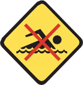
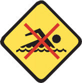
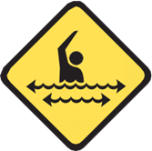
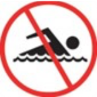
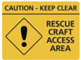

## Purpose

The purpose of this procedure is to enhance public safety and awareness through effective signage, thereby reducing the number and severity of incidents in the aquatic environment.

## Overview

All beach signage and flags must adhere to the standards outlined in the _National Aquatic & Recreational Signage Style Manual (3rd Edition)_ and the _Australian/New Zealand Standard 2416.1:2010_. These guidelines ensure consistency, clarity, and effectiveness in communicating safety information to the public.

SLS personnel are responsible for actively promoting the use of signage systems that comply with these standards, especially in cases where the signage is not provided by SLS. This ensures that all beachgoers receive accurate and standardised safety information, regardless of the signage's origin.

Any existing metal mobile beach signage should be replaced with hard-plastic alternatives when they are no longer serviceable. Hard-plastic signage is more durable, easier to maintain, and aligns with modern safety standards.

Furthermore, SLS services may only deploy ‘prohibition’ signage when they have received the appropriate delegated authority. This ensures that all prohibitive measures are legally supported and effectively communicated to the public, maintaining both safety and compliance with regulatory requirements.

## Procedure

Signage serves an important part of the overall education program which aims to reduce the number and severity of incidents in the aquatic environment.

Signage systems provide important messages to the public. These messages fall into three categories:

- Information.
- Warning.
- Prohibition.

| **Type** | **Function** | **Example** |
| --- | --- | --- |
| Information | Indicate direction or give general information, location, etc. | Patrolled area to north |
| Warning | Warn the public of a danger, a potentially dangerous situation or a hazardous environment exists. | Swimming not advised |
| Prohibition | Indicate that certain activities are prohibited. | No dogs |

### Location

Signage should provide appropriate information at point of entry and reinforces specific messages and information at additional specific sites.

### On Beach (Mobile Signage)

SLS personnel that have direct responsibility for on-beach signage must ensure that signs and message boards are erected at the appropriate access points and/or hazard locations.

SLS personnel must report on the availability and condition of all beach signage through their annual Gear and Equipment Inspections and Operations App.

Presentation is an important part of the ‘impact’ of on-beach signage.

Safety signage (and flags) must not have any form of signwriting or content other than the requirements of _Australian/New Zealand Standard 2416:2010_ and SLSA/SLSSA policies/requirements. All forms of signwriting/signage, flag-bases and flags must be endorsed by SLSSA.

Signs should be made of plastic material and any metal signage should be replaced as soon as practicable. Poles should be constructed of a non-hazardous material that limits impact of injury.

### Diamond vs Triangle Warning Signs

SLS services must use the existing diamond shaped warning symbols/signs. While the Standard provides both a diamond and triangle option, no lifesaving service will utilise ‘triangle’ warning symbols.

On particular beaches and/or at particular times of year, it may be prudent to delineate vehicle access onto/off the beach and/or from the patrol base to the waters edge. Traffic cones can be effective in ensuring a ‘path’ is kept clear of patrons and their belongings.

### Mobile (Patrol) Warning/Hazard Signage
The ‘swimming not advised’ sign should be used to warn of strong currents/rips at high-risk locations and access points. The specific ‘strong currents’ hazard sign should generally not be used for mobile warning signage and should rather feature within appropriate permanent access signage (as recommended by an appropriate public coastal risk assessment). However, the ‘swimming not advised’ sign may be displayed with descriptive text relating to the identified hazard leading to the recommendation that swimming is not advised (e.g. strong currents, dangerous rips and dangerous surf).

!\
Swimming Not Advised

\
Strong Currents (To be phased out)

### Mobile (Patrol) Prohibition/Warning Signage
Unless a service has delegated authority and supporting legislation to enforce a prohibition, no mobile prohibition signage (red circle/white background) should be used, but rather warning/advisory signage should be used (yellow diamond).

!\
Swimming Not Advised

\
Prohibition Signage (To be phased out)

### Rescue Craft Access Signage
All SLS services should utilise a set of 2 ‘rescue craft access’ signs to outline designated launching and beaching areas for powercraft (RWC, IRBs). Signage must be placed at the water’s edge on either side of the designated area and can be complemented by ‘orange cones’ as deemed necessary.

On particular beaches and/or at particular times of year, it may be prudent to delineate vehicle access onto/off the beach and/or from the patrol base to the waters edge. Traffic cones can be effective in ensuring a ‘path’ is kept clear of patrons and their belongings.

### References

- National Aquatic & Recreational Signage Style Manual (3rd Edition)
- Australian/New Zealand Standard 2416:2010.1,2 & 3 – Water Safety Signs and Beach Safety Flags
