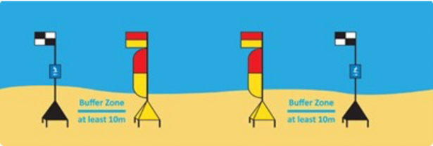
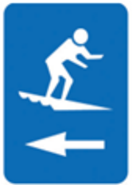
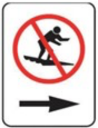
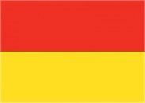
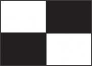

## Purpose

To standardise the use of safety flags at beaches, ensuring that Surf Life Saving services utilise internationally recognised flag systems to clearly designate patrolled swimming areas and surfcraft exclusion zones.

## Overview

Safety flags may be installed depending on the conditions and beach attendance. There are a standard set of safety flags which follow international standards to denote areas such as safe swimming area and surf craft area.

## Procedure

### Red and Yellow Patrol Flag and Feather (Augmentation)

SLS services must utilise the red and yellow patrol flag with the red and yellow feather (‘Beach Flag Augmentation’) as its standard for indicating the patrolled swimming zone at beaches.

The ‘feather’ also enhances public identification of the patrolled area from in the water so that the public can better ensure they continue swimming ‘between the flags’.

### Black and White Quartered Flag and Feather (Surfcraft Boundary)

Where the surf conditions warrant their use, SLS services should utilise the black and white quartered flag (with optional feather) to indicate surfcraft exclusion zones. Implementation of black/white ‘feathers’ requires SLSSA approval.

### Display of Surfcraft Signage with Black and White Flags

SLS also endorses the use of surfcraft directional or probation signs to be used in conjunction with surfcraft boundary flags. This may be through the placement of signs on the ‘flagpole’ or ‘pole base’. The most common example of this would be the use of a directional ‘surfcraft’ information sign on the flagpole. The use of the surfcraft prohibition sign should only be used where the service has delegated authority and supporting legislation to prohibit the activity.

\
Surfcraft Directional Signage (as shown in A/NZS 2416:2010.2)

\
Surfcraft Prohibition Signage (as shown in A/NZS 2416:2010.2)

### Table 1 – Flags approved for use by SLS services in SA

| Flag                     | Name                        | Description                                                                                           |
|--------------------------|-----------------------------|-------------------------------------------------------------------------------------------------------|
|| Patrol Flag                 | Pair of flags to signify a swimming and bodyboarding zone which has a patrol on-duty.                |
|| Patrol Flag – Feather       | Additional ‘feather’ flown only with rectangular patrol flag.                                         |
|| Surfcraft Boundary          | Pair of flags used to demarcate a surfboard and other water craft zone or boundary.                   |
|