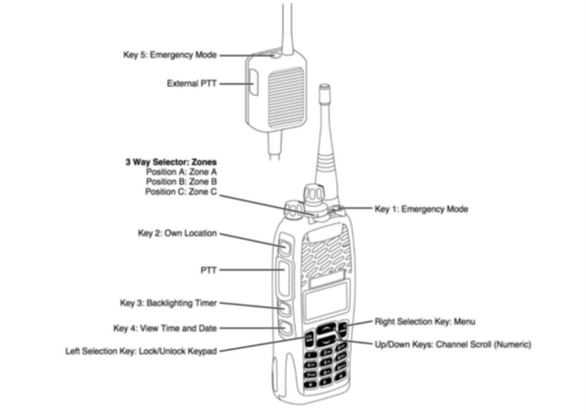
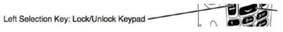

## Purpose

To ensure a consistent and standardised form of communication across SA, the following features exist on all SLSSA radios.

## Features

### Function Keys

 
### Keypad Lock
Push to Talk, volume control and Emergency Mode are the only features that work when the radio is locked. Buttons on the radio and channel selection will not work unless the keypad is unlocked. Keypad Lock Active will be displayed on the screen if a button is used before the keypad is unlocked.

Press and hold the lock/unlock keypad button to lock or unlock the keypad.

### Location

All radios on the SLSSA network work best on the beach and close to the water line. If you are unable to contact another radio user, you should change your position and try again.\

### GPS
All radios on the SLSSA network automatically transmit their GPS location to the State Operations Centre (SOC) to provide an overview of patrolling operations and to assist the SOC in allocating resources to incidents. Your position should be communicated to SOC as normal during incidents. Do not rely on GPS to provide your exact location in an emergency.

Press the Own Location button to see your GPS location. GPS locations are useful for determining a position of an object in a search.

### Transmitting
To transmit push and hold the Push to Talk (PTT) button and wait for the tone before speaking.

Transmitting is permitted for 60 seconds. A warning will sound after 50 seconds. To continue to transmit, release the PTT button when you hear the warning then press the PTT button to continue. If you continue to transmit after the warning without releasing the PTT button, you will not be able to transmit for 30 seconds unless you turn the radio off and on before transmitting.

### Messaging
The SOC can send a text message to any radio on the SLSSA Coastal Radio Network. In most cases, the SOC will send a message to the radio allocated to the Patrol Captain. Press Options to either view or delete the message. If the message is not opened the queue icon appears and information about the missed message may be shown on the display.

### Emergency Mode
The emergency mode button is to only be used in an emergency and is only monitored during SOC operational hours. Your position will be automatically transmitted to the SOC and the radio will automatically transmit for 10 seconds every 30 seconds. Your alert will be acknowledged by the SOC. An emergency alert may not be acknowledged outside of regular patrolling hours.

The emergency button is an additional resource. It does not replace RESCUE, RESCUE, RESCUE or requests for assistance via existing methods.

All requests, including assistance from other organisations, should be made via the SOC.

Note: An Emergency Mode alert will only be heard by the users on the channel you are operating on. For example, an alert on Channel 3 will be acknowledged by the SOC but will not be received or acknowledged on Channel 1.

#### Accidental Activation
- Notify the SOC if you have accidentally pressed the Emergency Mode button. 
- Turn the radio off and on again to reset the Emergency Mode.

### Useful Links
- [Best Practice for Radio Users (Manufacturer Video)](http://www.youtube.com/watch?v=u_Pu0bPM1Is)
- [Radio Operating Techniques (Manufacturer Video))](http://www.youtube.com/watch?v=Ib6Aw-Jh-Wc)